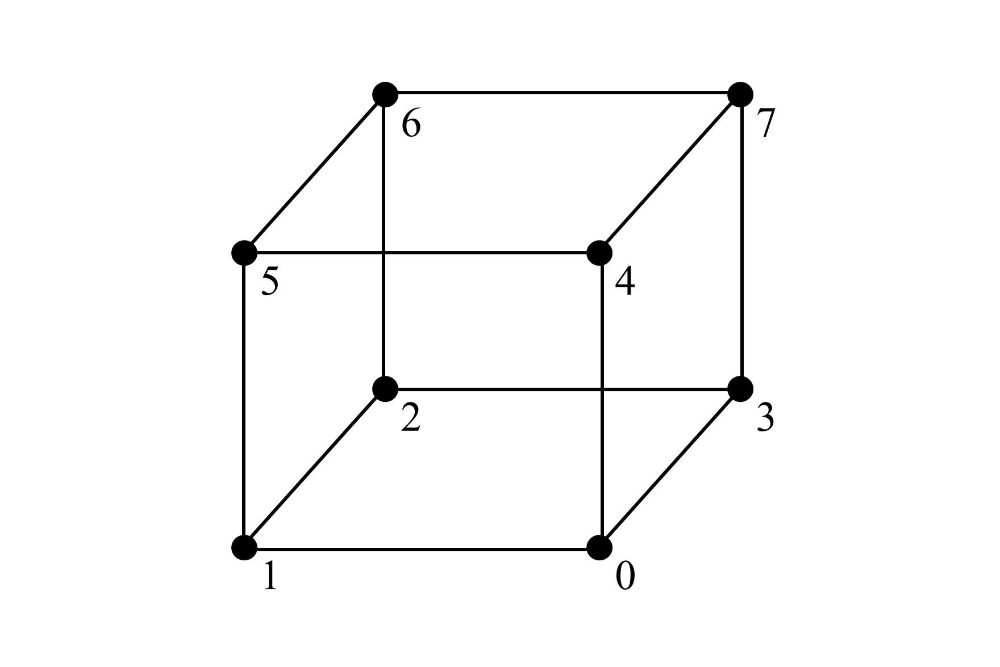
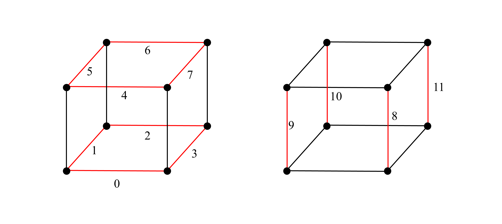
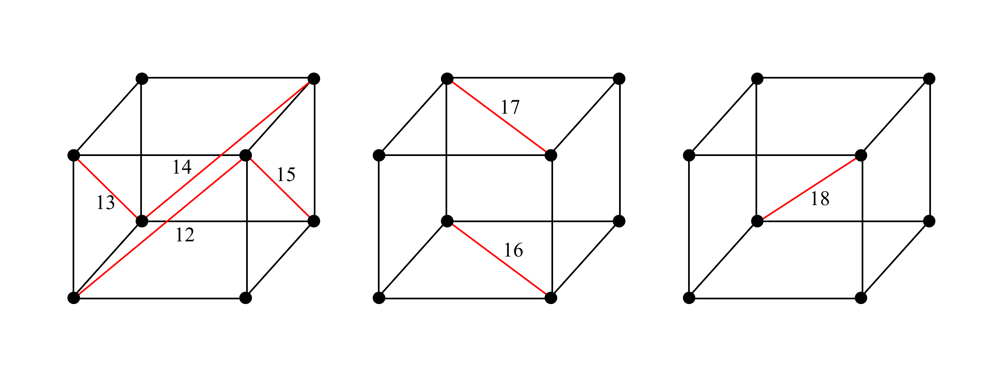

# Realtime-Isosurface-Generation
An Unreal Engine 5 project demonstrating real-time editing of meshes using the Marching Tetrahedra and Marching Cubes algorithms alongside the use of GPU compute shaders to accelerate mesh generation.

Both algorithms are developed so that they may be run entirely on the CPU or on the GPU in parallel.

The Marching Cubes algortihm is implemented in line with the [article by Paul Bourke](http://paulbourke.net/geometry/polygonise/).

## Marching Tetrahedra

For the Marching Tetrahedra algorithm, a decision must be made as to the parity of the grid cell and which edges are connected by diagonals.

For this, each vertex of the cube is given a unique integer to represent it:


From there, the edges are also given unique integer identifiers to describe the pair of vertices they connect:
```
const std::pair<int, int> cubeVerticesOnEdge[19] =
{
	{0, 1}, {1, 2}, {2, 3}, {0, 3},
	{4, 5}, {5, 6}, {6, 7}, {4, 7},
	{0, 4}, {1, 5}, {2, 6}, {3, 7},
	{1, 4}, {2, 5}, {2, 7}, {3, 4},
	{0, 2}, {4, 6}, {2, 4}
};
```

Alternatively, they may be visualised as such:



The 19 edges enclose 6 tetrahedra inside the cube, which may be described by the set of 4 vertices required to construct it:
```
const int tetrahedronList[6][4] = 
{
	{0, 1, 2, 4},
	{1, 2, 4, 5},
	{2, 4, 5, 6},
	{0, 2, 3, 4},
	{2, 3, 4, 7},
	{2, 7, 4, 6}
};
```

The data tables for this algorithm are broken down into two groups. Firstly, the tables associated with the whole 2x2x2 grid cell and secondly, the tables related to each individual tetrahedron. The tables that are for the whole grid cell are prepended by `cube`, whilst the tables for each tetrahedron are prepended by `tetrahedron`.
